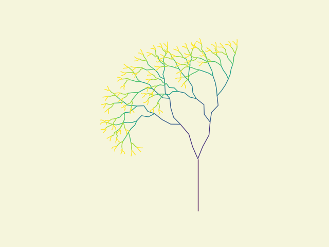
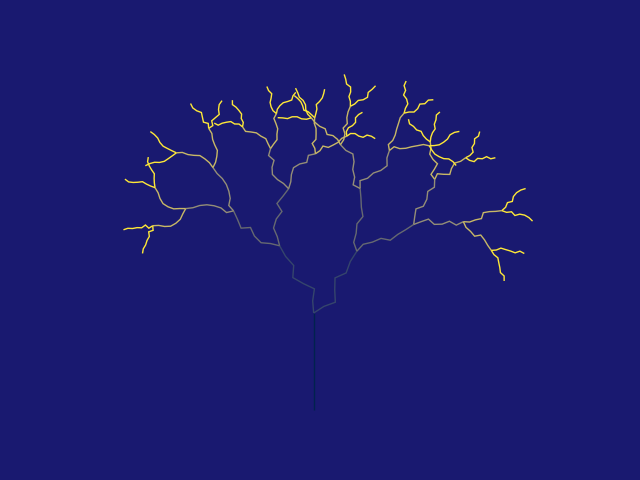
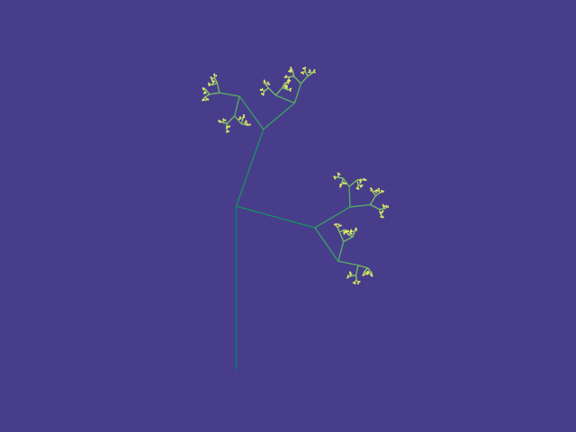
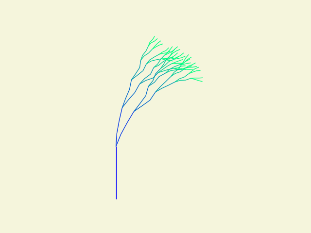
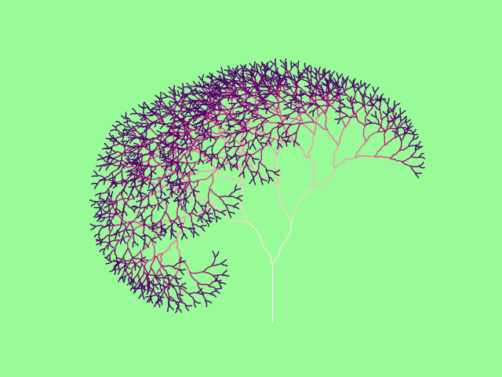

# Assignment 2: Fractal Generation Documentation

## Table of Contents

- [Pseudo-Code](#pseudo-code)
- [Technical Explanation](#technical-explanation)
- [Results](#results)
- [References](#references)

---

## Pseudo-Code

*(Provide detailed pseudo-code explaining the logic of your program. This should clearly outline your recursive functions, parameter definitions, and how they contribute to the final fractal pattern.)*

1. **Define function that generates a color based on recursion depth**
**function** get_color(depth, max_depth):
    **return** color based on depth / max_depth using color map

2. **Initialize tree structure**
**initialize** tree_branches as empty list
**initialize** fact with random value
**initialize** starting curve (vertical line) as LineString [(0, 0), (0, 1)]
**add** starting curve to tree_branches

3. **define recursive function for tree generation**
**function** recursive_tree(curve_list, counter, angle, kinks, tilt):
    **initialize** new_branches as empty list
    
   **for** each curve in curve_list:
        # calculate translation and kinks
        dx, dy = calculate the difference between start and end points of curve
        
        # generate kinks within each branch
        segment_length = 1 / (kinks + 1)
        kink_points = list starting from the line's endpoint
        
        **for** each kink:
            calculate new kink point based on a random small offset
            translate/move and rotate kink point around the previous kink point
            append kink point to kink_points

        # create kinked curve from kink points
        create line segments from kink_points using LineString
        
        # rotate kinked curve to create left and right branches
        branch_left = rotate kinked curve by angle * fact
        branch_right = rotate kinked curve by -angle * fact
        
        # add new branches to new_branches
        **append* branch_left and branch_right to new_branches
    
    # count recursions and stop when max depth is reached
   **increment** counter
   **add** new_branches to tree_branches
   **if** counter < recursion_depth:
        call recursive_tree with new_branches and updated counter

4. **set parameters for the recursion**
recursion_depth = 10 (repetitions)
angle = 30 (angle for branching)
kinks = 5 (number of kinks per branch)
tilt = 0.3 (tilt for kink direction)

5. **start tree generation**
**call** recursive_tree with initial parameters

6. **plot the result**
**create** a figure and axis for plotting
**set** canvas background color to 'palegreen'

**for** each recursion level in tree_branches:
    **for** each branch in level:
        plot branch with color based on recursion depth using get_color

# finalize and display
**set** aspect ratio to 1
**hide** plot axes
**show** plot

---

## Technical Explanation

*(Provide a concise explanation of your code, focusing on recursion and geometric manipulations. Discuss how your approach generates the final fractal pattern and the mathematical principles involved.)*

Example:

In my implementation, the `generate_fractal` function recursively draws line segments representing branches of a fractal tree. The function calculates the end point of each line using trigonometric functions based on the current angle and length.

At each recursion step, the function:

- Decreases the `length` by multiplying it with `length_scaling_factor`.
- Adjusts the `angle` by adding or subtracting `angle_change` to create branching.
- Calls itself recursively for each branch until the `recursion_depth` reaches zero.

This approach creates a self-similar pattern characteristic of fractals, where each branch splits into smaller branches in a consistent manner.

---

## Results

'''

'''

'''

'''

Example:

### Fractal Pattern 1: Basic Fractal Tree

- **Parameters**:
  - `angle_change`: 30°
  - `length_scaling_factor`: 0.7
  - `recursion_depth`: 5
- **Observations**:
  - The fractal tree exhibits symmetry and balance.
  - As the recursion depth increases, the level of detail in the branches increases.

*(Repeat for other fractal patterns.)*

---

## References

- **L-Systems**: [https://en.wikipedia.org/wiki/L-system](https://en.wikipedia.org/wiki/L-system)